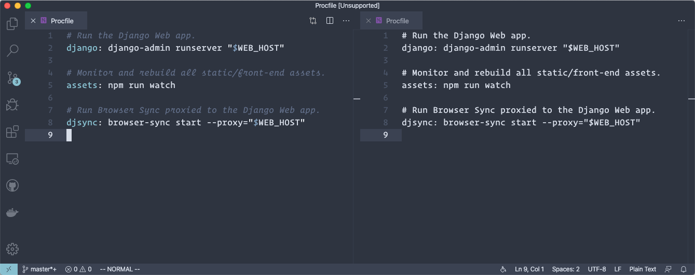

# `Procfile` extension for Visual Studio Code

A [Visual Studio Code][VSCode] [extension][VSCext] with support for
[`Procfile`s][Heroku].



The `Procfile` is mostly known for its use by [Heroku][] and [Foreman][]. However it
supported by a number of other services and utilities, and is extremely handy for
development. With this `.env` file:

```dotenv
DJANGO_SETTINGS_MODULE=my_site.settings.local
WEB_HOST=0.0.0.0:8000
BROWSERSYNC_PORT=9000
```

… and this `Procfile`:

```procfile
# Run the Django Web app.
django: django-admin runserver "$WEB_HOST"

# Monitor and rebuild all static/front-end assets.
assets: npm run watch

# Run Browser Sync proxied to the Django Web app.
djsync: browser-sync start --proxy="$WEB_HOST" --port="$BROWSERSYNC_PORT"
```

You can run `honcho start` and have it all up and running!

## Foreman & Clones

The most used and robust are:

- [Foreman][] (Ruby)
- [Honcho][] (Python)
- [Goreman][] (Go)

Others include:

- [node-foreman][Noreman] (Node) *— n.b. How on earth is this not named “Noreman”?
  I insist on referring to it as such!*
- [Shoreman][] (Shell)
- [forego][] (Go)

[VSCode]: https://code.visualstudio.com/
[VSCext]: https://marketplace.visualstudio.com/VSCode
[Heroku]: https://devcenter.heroku.com/articles/procfile
[Foreman]: http://ddollar.github.io/foreman/
[Honcho]: https://github.com/nickstenning/honcho
[Goreman]: https://github.com/mattn/goreman
[Noreman]: https://github.com/strongloop/node-foreman
[Shoreman]: https://github.com/chrismytton/shoreman
[forego]: https://github.com/ddollar/forego

There is no published standard for `Procfile` syntax, but Foreman can be used as the
reference implementation. Though the various runners recognize different things as
comments, process, or errors, Foreman’s syntax is recognized by this extension.

| *`Procfile`* |  Foreman  |  Honcho   |  Goreman  |  Noreman  |  Shoreman  |  forego  |
| ------------ |:---------:|:---------:|:---------:|:---------:|:----------:|:--------:|
| `n0 …      ` |     #     |     #     |     #     |        ✗  |         ✗  |       ✗  |
| `n1: …     ` |  ✓        |  ✓        |  ✓        |  ✓        |  ✓         |  ✓       |
| ` n2: …    ` |     #     |     #     |  ✓        |        ✗  |  ✓         |       ✗  |
| `n3 : …    ` |     #     |     #     |  ✓        |        ✗  |  ✓         |       ✗  |
| `n4:…      ` |  ✓        |  ✓        |  ✓        |  ✓        |         ✗  |  ✓       |
| `n 5: …    ` |     #     |     #     |  ✓        |        ✗  |  ✓   /  ✗  |       ✗  |
| `# n6: …   ` |     #     |     #     |     #     |     #     |     #      |       ✗  |
| `#n7: …    ` |     #     |     #     |     #     |     #     |     #      |       ✗  |
| `n-8: …    ` |  ✓        |     #     |  ✓        |  ✓        |  ✓         |  ✓       |
| `n9 :…     ` |     #     |     #     |  ✓        |        ✗  |  ✓         |       ✗  |

|     *legend*      |     |
| ----------------- |:---:|
| valid process     |  ✓  |
| comment / ignored |  #  |
| error / hang      |  ✗  |

## Release Notes

### 1.0.0

Recognize process names containing a `-` (dash) as valid. This is based on testing
Foreman and its clones to determine the most common subset of functionality.

### 0.1.1

Add an icon for the extension.


### 0.1.0

Initial release of `vscode-procfile` extension.
